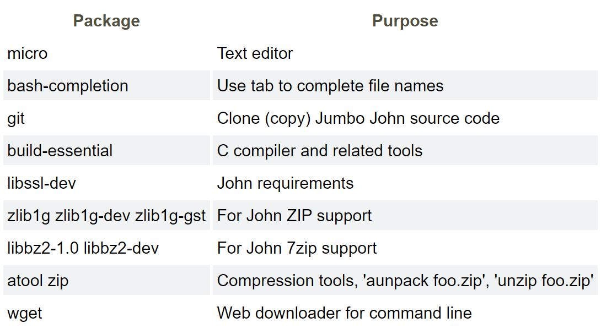

# InfoSec_h4
## Applied Cryptography
### 2.3 One-Way Functions
 
* One-way functions are mathematical functions that are easy to compute in one direction but difficult to invert.
* The one-way function is a crucial component of public-key cryptography.
* One-way functions are used in cryptography as the basis for key generation, digital signatures, passwords, messages, files, and message authentication codes. 
* A common example of a one-way function is the RSA algorithm, which uses the difficulty of factoring large prime numbers to encrypt and decrypt messages.
* Other examples of one-way functions include the Elliptic Curve Digital Signature Algorithm (ECDSA), the Digital Signature Algorithm (DSA), and Hash functions such as SHA-256.
* The security of one-way functions relies on mathematical problems that are believed to be hard to solve, such as the integer factorization problem and the discrete logarithm problem.
* One-way functions are considered to be a cornerstone of modern cryptography and play a crucial role in securing online communications and transactions.
* Public-key cryptography requires another element - a secret key that serves as a backdoor and enables the reversal of the function if it is known.
 
 
### 2.4 One-Way Hash Functions.
 
* One-way hash functions are used in cryptography for message authentication and integrity checks.
* The goal of a one-way hash function is to take an input (a message, for example) and produce a fixed-length output, also known as a hash or a message digest.
* One-way hash functions are a type of mathematical function used in cryptography
* They take an input (or "message") and produce a fixed-length output, called a "hash" or "message digest"
* The output should be unique to the input, so even a small change in the input will produce a completely different hash
* The authenticity of a copy can be confirmed by comparing the hash of the original pre-image with the hash of the copy. If there is any discrepancy, it means that the copy might have been modified, making it potentially less secure.
* The hash function should be irreversible, meaning that it should not be possible to determine the original input from the hash
* One-way hash functions are used for digital signatures, message authentication, and key derivation
* Common one-way hash functions include SHA-256, SHA-3, and MD5.
* The security of one-way hash functions relies on the assumption that it is infeasible to find two different inputs that produce the same hash (a "collision").
* Message authentication codes (MAC) and data authentication codes (DAC) are one-way hash functions with the added security of an encryption key being added to the pre-image. This way, only the intended recipient can check the hash value.
* Examples of one-way hash functions include SHA-256, SHA-3, and MD5.
* One-way hash functions are used in various security protocols, such as SSL/TLS, IPsec, and PGP.
 
 
### a) Install Hashcat
 
I installed Hashcat on my virtual machine by following the "Cracking Passwords with Hashcat" tutorial found on terokarvinen.com. Before proceeding with any actions on Linux, it is important to make sure your packages are up to date. This can be done using the following commands:
 
     $ sudo apt-get update && sudo apt-get upgrade -y
     
Now we are ready to start installing Hashcat. 

     $ sudo apt-get install hashid hashcat wget -y
     
Next, for convenience it is better to create a directory that will contain the hashes that we want to solve.

     $ mkdir unraveled 
     
     $ cd hashed
     
To begin the process of cracking hashes, it is required a comprehensive password dictionary. A widely used resource for this is the "rockyou.txt" file, which can be obtained from Github. To download the file, we can use the command to clone the Github repository into the directory that we have created.

     $ wget https://github.com/danielmiessler/SecLists/raw/master/Passwords/Leaked-Databases/rockyou.txt.tar.gz
     
Then unpackage it: 

     $ tar xf rockyou.txt.tar.gz
     
#Now we are ready!

 
### b) Crack this hash: 8eb8e307a6d649bc7fb51443a06a216f
 
 
 
 
### c) Compile John the Ripper, Jumbo version.
 
I installed Jumbo on my virtual machine by following the "Crack File Password With John" tutorial on terokarvinen.com.

    sudo apt-get install micro bash-completion git build-essential libssl-dev zlib1g zlib1g-dev zlib-gst libbz2-1.0 libbz2-dev atool zip wget -y
    

    
Next, lets get the Jumbo version of John the Ripper and compile it.

    $ git clone --depth=1 https://github.com/openwall/john.git
    
Then 

    $ cd john/src/	
    $ ./configure
 
Then the actual compilation

    $ make -s clean && make -sj4
 
### d) Crack a zip file password

Lets get the zip file that we need to unlock: 

    $ wget https://TeroKarvinen.com/2023/crack-file-password-with-john/tero.zip
 
 
### n) Voluntary: create a password protected file other than ZIP. Crack the password. How many formats can you handle?
 
 
 
 
 
### References:
* https://learning.oreilly.com/library/view/applied-cryptography-protocols/9781119096726/10_chap02.html#chap02-sec003
* https://terokarvinen.com/2022/cracking-passwords-with-hashcat/
* https://terokarvinen.com/2023/crack-file-password-with-john/
* https://libguides.haaga-helia.fi/az.php
